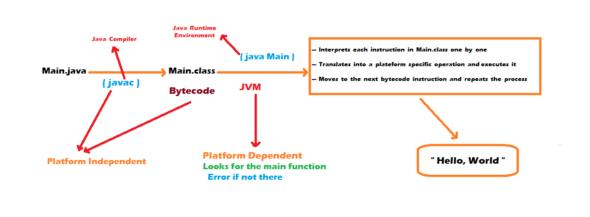

# JDK
- A software development environment used  to develope applications.
- Provide all the necessary tools, libraries, and runtime environment required to build and run programs.

# What happens when we press the Run button in IDE ?

# Key Components 
- ## Java Compiler(javac):
  - Coverts java source code into bytecode
  - bytecode is excuted by the Java Virtual Machine(JVM)
- ## Java RuntimeEnvironment(JRE)
  - Includes the Jvm and the essential libraries to run java application 
  - acts as the running art of java
- ## Java Virtual Machine(JVM)
  - Excutes the compiled java bytecode on various platforms
  -provides platform independence (write once, run aynwhere)
- ## API Libraries 
- ## Debugger
- ## Build automation : 
    - The IDE can automation tasks such as compiling code, packaging software, running unit tests, and deploying applications.
- ## Version Control Integration
- ## etc...